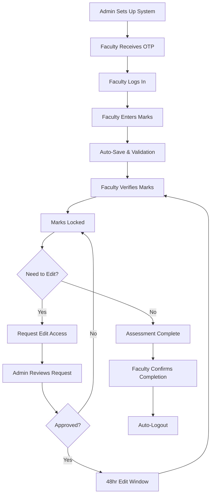
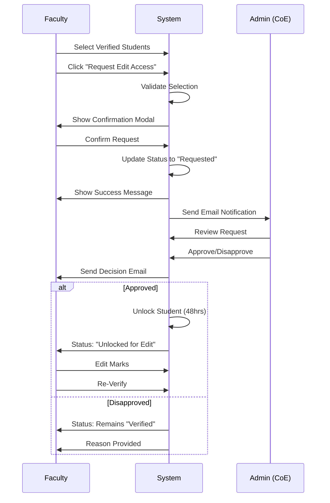
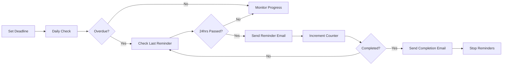

# 📊 Project/Dissertation Assessment Management System

<div align="center">


**Sri Sathya Sai Institute of Higher Learning**

A comprehensive web-based assessment management system for faculty to manage project/dissertation evaluations with intelligent workflows, deadline tracking, and secure edit controls.

[](https://developers.google.com/apps-script)
[](https://developer.mozilla.org/en-US/docs/Web/HTML)
[](https://developer.mozilla.org/en-US/docs/Web/JavaScript)
[](https://www.google.com/sheets/about/)

</div>

---

## 📋 Table of Contents

- [Overview](#-overview)
- [Key Features](#-key-features)
- [System Architecture](#-system-architecture)
- [Technology Stack](#-technology-stack)
- [Installation & Setup](#-installation--setup)
- [User Guide](#-user-guide)
- [System Workflow](#-system-workflow)
- [Security Features](#-security-features)
- [API Reference](#-api-reference)
- [Troubleshooting](#-troubleshooting)
- [Contributing](#-contributing)
- [License](#-license)

---

## 🎯 Overview

The **Project/Dissertation Assessment Management System** is a sophisticated, cloud-based platform designed specifically for educational institutions to streamline the assessment process for project-based evaluations. Built on Google Apps Script and Google Sheets, it provides faculty members with an intuitive interface to manage student assessments while maintaining strict data integrity and audit trails.

### Why This System?

- **Eliminates Paper-Based Processes**: Digital workflow reduces errors and processing time
- **Ensures Data Integrity**: Multi-level verification system prevents unauthorized changes
- **Tracks Deadlines**: Automated reminder system ensures timely completion
- **Maintains Audit Trail**: Complete history of all changes and approvals
- **Scalable Solution**: Handles multiple faculties, papers, and students simultaneously

---

## ✨ Key Features

### 🔐 Authentication & Security

- **OTP-Based Login**: Secure one-time password authentication via email
- **Session Management**: Auto-logout on inactivity and completion confirmation
- **Role-Based Access**: Faculty can only access their assigned students
- **Email Validation**: Institutional email verification for access control

### 📝 Marks Management

- **Dynamic Max Marks**: Support for variable maximum marks per student (default: 100)
- **Real-Time Auto-Save**: Automatic saving with visual feedback (2-second debounce)
- **Input Validation**: Prevents invalid marks entry with immediate feedback
- **Bulk Operations**: Select and verify multiple students simultaneously
- **Status Tracking**: Real-time status indicators for each student's progress

### 🔒 Verification & Edit Control

- **Mark Verification**: Lock marks after verification to prevent accidental changes
- **Edit Request System**: Structured workflow for requesting access to verified marks
- **CoE Approval**: Controller of Examinations must approve all edit requests
- **48-Hour Edit Window**: Time-limited access after approval
- **Pending Request Tracking**: Visual indicators for requests awaiting approval

### ⏰ Deadline Management

- **Faculty Deadlines**: Set individual deadlines for each faculty member
- **Automated Reminders**: Email reminders for overdue submissions
- **Progress Tracking**: Real-time statistics on completion rates
- **Completion Confirmation**: Faculty can confirm when all assessments are complete
- **Admin Notifications**: Alerts sent to administrators on completion

### 📧 Email System

- **Bulk OTP Generation**: Send OTPs to all faculty members at once
- **Individual Resend**: Resend OTP to specific faculty if needed
- **Approval Notifications**: Automatic emails on edit request approval/disapproval
- **Deadline Reminders**: Escalating reminder emails for overdue assessments
- **Completion Alerts**: Notifications when assessment phase is complete

### 📊 Analytics & Reporting

- **Paper-Wise Analysis**: Detailed breakdown by paper code
- **Faculty Progress**: Track completion rates per faculty
- **Campus Statistics**: Aggregated data across campuses (if applicable)
- **Grade Distribution**: Marks distribution analysis
- **Completion Reports**: Comprehensive reports on assessment completion

### 🎨 User Experience

- **Modern UI**: Clean, intuitive interface with university branding
- **Responsive Design**: Works on desktop, tablet, and mobile devices
- **Visual Feedback**: Real-time status changes with color-coded indicators
- **Toast Notifications**: Non-intrusive success/error messages
- **Loading Animations**: University logo during data operations
- **Modal Confirmations**: Clear warnings before critical actions

---

## 🏗️ System Architecture

```
┌─────────────────────────────────────────────────────────────────┐
│                        Faculty Browser                          │
│  ┌──────────────────────────────────────────────────────────┐  │
│  │            faculty_portal.html (Frontend)                 │  │
│  │  • Login Interface                                        │  │
│  │  • Marks Entry Form                                       │  │
│  │  • Status Dashboard                                       │  │
│  │  • Bulk Operations                                        │  │
│  └────────────────────┬─────────────────────────────────────┘  │
└────────────────────────┼─────────────────────────────────────────┘
                         │
                         │ HTTPS (google.script.run)
                         │
┌────────────────────────▼─────────────────────────────────────────┐
│                   Google Apps Script                             │
│  ┌──────────────────────────────────────────────────────────┐  │
│  │                Code.gs (Backend)                          │  │
│  │  • Authentication (verifyOTP)                             │  │
│  │  • Data Management (getStudents, autoSaveMarks)           │  │
│  │  • Verification Logic (bulkVerifyMarks)                   │  │
│  │  • Edit Request Workflow (requestEditAccess)              │  │
│  │  • Email System (sendEmails, sendReminders)               │  │
│  │  • Deadline Management (checkOverdueFaculties)            │  │
│  └────────────────────┬─────────────────────────────────────┘  │
└────────────────────────┼─────────────────────────────────────────┘
                         │
                         │ Google Sheets API
                         │
┌────────────────────────▼─────────────────────────────────────────┐
│                    Google Sheets Database                        │
│  ┌──────────────────────────────────────────────────────────┐  │
│  │  Sheet: Project_mapping (Main Data)                      │  │
│  │  • Student Records                                        │  │
│  │  • Marks & Verification Status                            │  │
│  │  • Faculty Assignments                                    │  │
│  ├──────────────────────────────────────────────────────────┤  │
│  │  Sheet: EditRequests (Approval Workflow)                 │  │
│  │  • Pending Edit Requests                                  │  │
│  │  • Approval/Disapproval History                           │  │
│  │  • Unlock Time Windows                                    │  │
│  ├──────────────────────────────────────────────────────────┤  │
│  │  Sheet: FacultyDeadlines (Deadline Tracking)             │  │
│  │  • Faculty-wise Deadlines                                 │  │
│  │  • Progress Statistics                                    │  │
│  │  • Reminder History                                       │  │
│  ├──────────────────────────────────────────────────────────┤  │
│  │  Sheet: EmailLog (Audit Trail)                           │  │
│  │  • All Email Activity                                     │  │
│  │  • Timestamps & Status                                    │  │
│  ├──────────────────────────────────────────────────────────┤  │
│  │  Sheet: PaperAnalysis (Reports)                          │  │
│  │  • Completion Statistics                                  │  │
│  │  • Grade Distribution                                     │  │
│  │  • Faculty/Campus Analytics                               │  │
│  └──────────────────────────────────────────────────────────┘  │
└──────────────────────────────────────────────────────────────────┘
```

### Data Flow

1. **Authentication Flow**: Faculty → OTP Verification → Session Creation → Dashboard Access
2. **Marks Entry Flow**: Input → Validation → Auto-Save → Status Update → UI Refresh
3. **Verification Flow**: Selection → Confirmation → Lock Marks → Clear Selection
4. **Edit Request Flow**: Request → CoE Notification → Approval → 48hr Unlock → Re-verification
5. **Deadline Flow**: Set Deadline → Track Progress → Send Reminders → Confirm Completion

---

## 💻 Technology Stack

### Backend
- **Google Apps Script** (JavaScript-based)
  - Server-side logic and API
  - Google Sheets integration
  - Gmail API for email notifications
  - Properties Service for session management

### Frontend
- **HTML5** - Structure and semantic markup
- **CSS3** - Modern styling with animations
  - Flexbox & Grid layouts
  - CSS animations for status indicators
  - Responsive design
- **Vanilla JavaScript** - Client-side logic
  - No external dependencies
  - Session management
  - Real-time UI updates
  - Form validation

### Data Storage
- **Google Sheets** - Primary database
  - Project_mapping: Main data sheet
  - EditRequests: Approval workflow
  - FacultyDeadlines: Deadline tracking
  - EmailLog: Audit trail
  - PaperAnalysis: Reports

### Communication
- **Gmail API** - Email notifications
- **Google Apps Script Web App** - HTTPS endpoints

---

## 🚀 Installation & Setup

### Prerequisites

- Google account with access to Google Sheets and Apps Script
- Institutional email system for OTP delivery
- Administrative access to create and configure Google Sheets

### Step-by-Step Setup

#### 1. Create Google Sheet

```
1. Go to Google Sheets (sheets.google.com)
2. Create a new spreadsheet
3. Name it: "Project Assessment Management System"
```

#### 2. Set Up Main Data Sheet

```
1. Rename Sheet1 to "Project_mapping"
2. Add the following headers in Row 1:
   - Sl. No.
   - Programme Name
   - Campus
   - Semester
   - Regd. No.
   - Student Name
   - Paper Code
   - Paper Title
   - Examiner
   - Examiner Email
   - Exam
   - Credits
   - Max Marks
   - Marks (100)
   - Verified
```

#### 3. Deploy Apps Script

```
1. In your Google Sheet, click Extensions → Apps Script
2. Delete any existing code in Code.gs
3. Copy the entire backend code from Code.gs
4. Save the project (name it: "Assessment System Backend")
```

#### 4. Create Frontend HTML

```
1. In Apps Script editor, click the + next to Files
2. Select "HTML"
3. Name it: "faculty_portal"
4. Delete default content
5. Copy the entire HTML code from faculty_portal.html
6. Save the file
```

#### 5. Configure Constants

In `Code.gs`, update these constants if needed:

```javascript
const ADMIN_EMAIL = "your-admin@institution.edu";  // Change to your admin email
const WEB_APP_URL = "YOUR_DEPLOYED_WEB_APP_URL";   // Update after deployment
```

#### 6. Deploy Web App

```
1. In Apps Script, click "Deploy" → "New deployment"
2. Select type: "Web app"
3. Description: "Faculty Assessment Portal"
4. Execute as: "Me"
5. Who has access: "Anyone" (with institutional email)
6. Click "Deploy"
7. Copy the Web App URL
8. Update WEB_APP_URL constant in Code.gs with this URL
9. Re-deploy the script
```

#### 7. Set Up Triggers (Automated Reminders)

```
1. In Apps Script, click "Triggers" (clock icon)
2. Click "+ Add Trigger"
3. Choose function: checkOverdueFaculties
4. Event source: "Time-driven"
5. Type: "Day timer"
6. Time of day: "8am to 9am" (recommended)
7. Save trigger
```

#### 8. Grant Permissions

```
1. Run any function from Apps Script editor (e.g., initialize)
2. Click "Review permissions"
3. Select your Google account
4. Click "Advanced" → "Go to [Project Name] (unsafe)"
5. Click "Allow"
```

#### 9. Initialize System

```
1. In Google Sheet, refresh the page
2. You should see a new menu: "Exam Tools"
3. Click "Exam Tools" → "Send Email"
4. This will:
   - Create all necessary sheets
   - Generate OTPs for faculty
   - Send login credentials via email
```

### Configuration Options

#### Sheet Names (if you want to customize)

```javascript
const SHEET_NAME = "Project_mapping";              // Main data sheet
const EDIT_REQUESTS_SHEET = "EditRequests";        // Edit workflow
const FACULTY_DEADLINES_SHEET = "FacultyDeadlines"; // Deadline management
const ANALYSIS_SHEET_NAME = "PaperAnalysis";       // Reports
```

#### Email Templates

Customize email templates in these functions:
- `sendCoeNotification()` - Edit request notifications
- `sendEditApprovalNotification()` - Approval emails
- `sendDisapprovalNotification()` - Rejection emails
- `sendDeadlineReminder()` - Overdue reminders

---

## 📖 User Guide

### For Faculty Members

#### Logging In

1. **Receive OTP Email**
   - Check your institutional email for OTP
   - Subject: "Faculty Portal Access - Your One-Time Password"
   - OTP format: 6-digit number

2. **Access Portal**
   - Open the Faculty Portal URL (provided by admin)
   - Enter your institutional email address
   - Enter the 6-digit OTP
   - Click "Access Portal"

3. **First-Time Setup**
   - Review your assigned students
   - Note the max marks for each student (may vary)
   - Check deadline information (if set)

#### Entering Marks

1. **Individual Entry**
   ```
   • Locate student by Registration Number
   • Enter marks in the "Marks" column
   • System auto-saves after 2 seconds
   • Watch status change: "Enter Marks" → "Getting saved" → "Saved"
   ```

2. **Validation Rules**
   - Marks must be between 0 and max marks for that student
   - Decimal marks are supported (e.g., 85.5)
   - Empty input is allowed (saved as blank)
   - Invalid entries show red border with warning

3. **Auto-Save Indicators**
   - 🟡 Yellow dot: Modified, waiting to save
   - 🔵 Blue dot: Saving in progress
   - 🟢 Green check: Successfully saved
   - 🔴 Red X: Save failed (will retry)

#### Verifying Marks

1. **Select Students**
   ```
   • Click "Select All" to select students with marks
   • Or manually check boxes next to students
   • Button shows count: "Verify (5)"
   ```

2. **Verify**
   ```
   • Click "✅ Verify" button
   • Confirm the action in modal
   • Marks are now locked
   • Status changes to "Verified & Locked"
   ```

3. **What Verification Does**
   - Locks marks from further editing
   - Marks cannot be changed without approval
   - Selection is automatically cleared
   - Student shows green "Verified" status

#### Requesting Edit Access

1. **When You Need It**
   - Made a mistake in verified marks
   - Need to update marks after verification
   - Student submitted late work

2. **How to Request**
   ```
   • Select verified students (check boxes)
   • Click "📝 Request Edit Access"
   • Review selected students in modal
   • Click "Submit Request"
   • Status changes to "Edit Access Requested"
   ```

3. **What Happens Next**
   - Administrator receives email notification
   - You receive email confirmation
   - Status shows purple "Requested" badge
   - Wait for approval email (usually 24-48 hours)

4. **After Approval**
   - Status changes to "Unlocked for Edit"
   - Row highlighted in yellow
   - You have 48 hours to edit
   - Re-verify after editing

#### Bulk Operations

1. **Select All with Marks**
   - Selects all students with marks entered
   - Excludes verified and pending students
   - Use before bulk verification

2. **Select All for Edit**
   - Selects all verified students
   - Use before requesting edit access
   - Excludes students with pending requests

3. **Clear Selection**
   - Deselects all students
   - Use to start fresh selection

### For Administrators (CoE)

#### Managing Edit Requests

1. **View Requests**
   ```
   • Open Google Sheet
   • Go to "EditRequests" tab
   • Pending requests highlighted in yellow
   ```

2. **Approve Request**
   ```
   • Select the request row
   • Click "CoE Functions" → "Approve Selected Request"
   • Confirm approval
   • Faculty receives email notification
   • Student unlocked for 48 hours
   ```

3. **Disapprove Request**
   ```
   • Select the request row
   • Click "CoE Functions" → "Disapprove Selected Request"
   • Enter reason for disapproval
   • Confirm action
   • Faculty receives email with reason
   ```

4. **Bulk Approve**
   ```
   • Click "CoE Functions" → "Approve All Pending"
   • Confirm bulk action
   • All pending requests processed
   • Emails sent to all faculty
   ```

#### Setting Deadlines

1. **Set Individual Deadline**
   ```
   • Click "Deadline Management" → "Set Faculty Deadline"
   • Enter faculty email
   • Enter due date (YYYY-MM-DD format)
   • System automatically tracks progress
   ```

2. **Deadline Features**
   - Automatic progress tracking
   - Email reminders for overdue submissions
   - Escalating reminder frequency
   - Completion confirmation tracking

#### Generating Reports

1. **Paper Analysis**
   ```
   • Click "Exam Tools" → "Analysis"
   • System generates comprehensive report
   • View in "PaperAnalysis" sheet
   • Export as PDF/Excel if needed
   ```

2. **Report Contents**
   - Overall statistics
   - Faculty-wise progress
   - Campus-wise breakdown (if applicable)
   - Grade distribution
   - Completion rates

#### Email Management

1. **Send OTPs to All Faculty**
   ```
   • Click "Email System" → "Send OTP to All Faculty"
   • System generates unique OTPs
   • Emails sent to all faculty
   • OTPs valid until regenerated
   ```

2. **Resend Individual OTP**
   ```
   • Click "Email System" → "Send Individual OTP"
   • Enter faculty email
   • New OTP generated and sent
   ```

3. **View Email Log**
   ```
   • Click "Email System" → "View Email Log"
   • See all email activity
   • Check delivery status
   ```

---

## 🔄 System Workflow

### Standard Assessment Workflow



### Edit Request Workflow



### Deadline Reminder Workflow



---

## 🔐 Security Features

### Authentication & Authorization

- **OTP-Based Login**: 6-digit one-time passwords sent via institutional email
- **Email Verification**: Only institutional email addresses accepted
- **Session Management**: Secure session tokens with timeout
- **Role-Based Access**: Faculty can only access assigned students
- **Auto-Logout**: Automatic logout on inactivity or completion

### Data Protection

- **Mark Verification Lock**: Prevents unauthorized changes to verified marks
- **Approval Workflow**: Admin approval required for edit access
- **Time-Limited Access**: 48-hour window for approved edits
- **Audit Trail**: Complete history of all actions in EmailLog sheet
- **Input Validation**: Client and server-side validation prevents invalid data

### Integrity Controls

- **Duplicate Prevention**: Cannot submit multiple requests for same student
- **Concurrent Edit Prevention**: Session tracking prevents simultaneous edits
- **State Preservation**: Session state maintained across refreshes
- **Rollback Mechanism**: Failed operations rollback to previous state
- **Completion Lock**: Assessment locked after faculty confirms completion

### Privacy Measures

- **Minimal Data Exposure**: Faculty only see assigned students
- **Secure Communication**: All API calls via HTTPS
- **No External Dependencies**: No third-party libraries or APIs
- **Google Infrastructure**: Leverages Google's security infrastructure
- **Access Logs**: All access attempts logged in EmailLog

---

## 🔧 API Reference

### Faculty-Facing Functions

#### `verifyOTP(email, otp)`
Authenticates faculty using OTP.

**Parameters:**
- `email` (string): Faculty institutional email
- `otp` (string): 6-digit OTP

**Returns:** `boolean` - Authentication success

**Example:**
```javascript
google.script.run
  .withSuccessHandler(handleSuccess)
  .verifyOTP("faculty@institution.edu", "123456");
```

---

#### `getStudents(email)`
Retrieves students assigned to faculty.

**Parameters:**
- `email` (string): Faculty email

**Returns:** `Array<Student>` - Array of student objects

**Student Object:**
```javascript
{
  regdNo: "2021001",
  name: "John Doe",
  paperCode: "CS401",
  paperTitle: "Machine Learning",
  programmeName: "M.Sc Computer Science",
  semester: "IV",
  exam: "Dissertation",
  credits: "4",
  maxMarks: 100,
  examinerName: "Dr. Smith",
  marks: 85,
  verified: "✅",
  isUnlocked: false,
  canEdit: false,
  isInEditMode: false,
  hasPendingRequest: false
}
```

---

#### `autoSaveMarks(email, regdNo, marks)`
Auto-saves marks for a student.

**Parameters:**
- `email` (string): Faculty email
- `regdNo` (string): Student registration number
- `marks` (number|null): Marks to save

**Returns:** `Object` - Save status

**Response:**
```javascript
{
  success: true,
  message: "Auto-saved for 2021001"
}
```

---

#### `bulkVerifyMarks(email, regdNos)`
Verifies and locks marks for multiple students.

**Parameters:**
- `email` (string): Faculty email
- `regdNos` (Array<string>): Array of registration numbers

**Returns:** `Object` - Verification results

**Response:**
```javascript
{
  success: true,
  message: "Bulk verification completed: 5 verified, 0 errors",
  successCount: 5,
  errorCount: 0,
  results: [
    { regdNo: "2021001", success: true, message: "Marks verified successfully" },
    // ...
  ]
}
```

---

#### `requestEditForSelectedStudents(email, regdNos)`
Requests edit access for verified students.

**Parameters:**
- `email` (string): Faculty email
- `regdNos` (Array<string>): Registration numbers

**Returns:** `Object` - Request submission status

**Response:**
```javascript
{
  success: true,
  message: "Successfully submitted 3 edit request(s)",
  processedCount: 3,
  totalRequested: 3,
  errors: [],
  warnings: [],
  duplicateRequests: [],
  invalidStudents: [],
  timestamp: "2025-01-15T10:30:00.000Z"
}
```

---

### Admin Functions

#### `approveSelectedRequest()`
Approves selected edit request (UI-triggered).

**Behavior:**
- Gets selected row from EditRequests sheet
- Validates request status
- Sets 48-hour unlock window
- Sends approval email to faculty
- Updates request status

---

#### `disapproveSelectedRequest()`
Disapproves selected edit request with reason.

**Behavior:**
- Prompts for disapproval reason
- Updates request status
- Sends disapproval email with reason
- Logs action

---

#### `setFacultyDeadline(email, dueDate, notes)`
Sets assessment deadline for faculty.

**Parameters:**
- `email` (string): Faculty email
- `dueDate` (Date|string): Due date
- `notes` (string): Optional notes

**Returns:** `Object` - Operation status

---

#### `checkOverdueFaculties()`
Checks for overdue submissions and sends reminders.

**Behavior:**
- Runs daily via trigger
- Identifies overdue faculty
- Sends reminder emails
- Updates reminder count
- Logs activity

---

## 🐛 Troubleshooting

### Common Issues & Solutions

#### Login Issues

**Problem:** OTP not received
```
Solutions:
1. Check spam/junk folder
2. Verify email address is correct
3. Request admin to resend OTP: "Email System" → "Send Individual OTP"
4. Ensure institutional email is active
```

**Problem:** "Invalid OTP" error
```
Solutions:
1. Verify OTP is exactly 6 digits
2. Check for extra spaces before/after OTP
3. Request new OTP if expired
4. Ensure email matches exactly (case-insensitive but check for typos)
```

---

#### Marks Entry Issues

**Problem:** Marks not saving
```
Solutions:
1. Check internet connection
2. Verify marks are within 0-maxMarks range
3. Wait for auto-save indicator (2 seconds)
4. Refresh page and re-enter if needed
5. Check browser console for errors (F12)
```

**Problem:** "Session expired" message
```
Solutions:
1. Logout and login again
2. Clear browser cache and cookies
3. Try incognito/private browsing mode
4. Contact admin if issue persists
```

---

#### Verification Issues

**Problem:** Cannot select students for verification
```
Solutions:
1. Ensure marks are entered for students
2. Check students aren't already verified
3. Verify no pending edit requests exist
4. Try "Clear Selection" then select again
```

**Problem:** "Verified but need to edit" error
```
Solutions:
1. Use "Request Edit Access" button
2. Select verified students
3. Submit request to admin
4. Wait for approval email
```

---

#### Edit Request Issues

**Problem:** Request button disabled
```
Possible Reasons:
• No students selected
• Selected students not verified
• Students already have pending requests
• Students are unlocked (no request needed)

Solution: Check status badges and select only verified students
```

**Problem:** Request showing "pending" indefinitely
```
Solutions:
1. Check email for approval/disapproval
2. Contact admin to check request status
3. Admin should check EditRequests sheet
4. May need to refresh portal after approval
```

---

#### Email Issues

**Problem:** Not receiving emails
```
Admin Solutions:
1. Check EmailLog sheet for delivery status
2. Verify "Email System" → "Check Email Status"
3. Ensure sufficient email quota
4. Check if emails marked as spam
5. Run "Email System" → "Diagnose Email Issues"
```

**Problem:** Email quota exceeded
```
Admin Solutions:
1. Wait for quota reset (daily at midnight GMT)
2. Use "Send Individual OTP" for specific faculty
3. Consider using Google Workspace (higher quotas)
4. Schedule bulk emails during off-peak hours
```

---

### Debugging Tools

#### For Faculty

```javascript
// Open browser console (F12) and run:

// Check session status
window.debugEnhancedSession();

// Force refresh data
window.forceRefresh();

// Reset session
window.resetSession();
```

#### For Admins

```javascript
// In Apps Script editor, run these functions:

// Debug sheet structure
debugSheetHeaders();

// Check approval system
testApprovalSystem();

// Test unlock system
testUnlockSystem();

// Check email system
testEmailSystem();

// Diagnose issues
troubleshootEmailIssues();
```

---

## 🤝 Contributing

We welcome contributions from the community! Here's how you can help:

### Types of Contributions

- 🐛 **Bug Reports**: Report issues via GitHub Issues
- 💡 **Feature Requests**: Suggest new features
- 🔧 **Code**: Submit pull requests with improvements
- 🧪 **Testing**: Help test new features

### Development Setup

1. Fork the repository
2. Clone your fork
3. Create feature branch: `git checkout -b feature/amazing-feature`
4. Make changes and test thoroughly
5. Commit: `git commit -m 'Add amazing feature'`
6. Push: `git push origin feature/amazing-feature`
7. Open Pull Request

### Coding Standards

- Use meaningful variable and function names
- Add comments for complex logic
- Follow existing code style
- Include error handling
- Test all changes before committing
- Update documentation for new features

### Pull Request Process

1. Update README.md with details of changes
2. Update API documentation if adding/changing functions
3. Ensure all tests pass
4. Request review from maintainers
5. Address review feedback
6. Wait for approval and merge

---

## 📄 License

This project is licensed under the **MIT License** - see below for details:

```
MIT License

Copyright (c) 2025 Sri Sathya Sai Institute of Higher Learning

Permission is hereby granted, free of charge, to any person obtaining a copy
of this software and associated documentation files (the "Software"), to deal
in the Software without restriction, including without limitation the rights
to use, copy, modify, merge, publish, distribute, sublicense, and/or sell
copies of the Software, and to permit persons to whom the Software is
furnished to do so, subject to the following conditions:

The above copyright notice and this permission notice shall be included in all
copies or substantial portions of the Software.

THE SOFTWARE IS PROVIDED "AS IS", WITHOUT WARRANTY OF ANY KIND, EXPRESS OR
IMPLIED, INCLUDING BUT NOT LIMITED TO THE WARRANTIES OF MERCHANTABILITY,
FITNESS FOR A PARTICULAR PURPOSE AND NONINFRINGEMENT. IN NO EVENT SHALL THE
AUTHORS OR COPYRIGHT HOLDERS BE LIABLE FOR ANY CLAIM, DAMAGES OR OTHER
LIABILITY, WHETHER IN AN ACTION OF CONTRACT, TORT OR OTHERWISE, ARISING FROM,
OUT OF OR IN CONNECTION WITH THE SOFTWARE OR THE USE OR OTHER DEALINGS IN THE
SOFTWARE.
```

---

## 👥 Authors & Acknowledgments

### Development Team
- **Project Lead**: Examination Section, SSSIHL
- **Developer**: Sai Sathya Jain
- **Testing**: Examination Section members


### Acknowledgments

- Sri Sathya Sai Institute of Higher Learning for institutional support
- Faculty members for valuable feedback during development
- Google Apps Script community for resources and examples


### Version History

- **v1.0.0** (2025-01-15): Initial release
  - Basic marks entry and verification
  - Edit request workflow
  - Email notification system
  - Deadline management

---

## 📊 System Requirements

### For Faculty Users

**Browser Requirements:**
- Chrome 90+ (Recommended)
- Firefox 88+
- Safari 14+
- Edge 90+

**System Requirements:**
- Any device with modern browser
- Internet connection
- JavaScript enabled
- Cookies enabled

### For Administrators

**Additional Requirements:**
- Google account with Sheet access
- Apps Script execution permissions
- Email sending permissions
- Sufficient Google Drive storage

---

## 🎓 Best Practices

### For Faculty

1. **Regular Backups**: Don't rely solely on auto-save
2. **Verify Before Locking**: Double-check all marks before verification
3. **Request Edit Thoughtfully**: Only request edit access when truly needed
4. **Meet Deadlines**: Respond to reminder emails promptly
5. **Clear Communication**: Provide clear reasons for edit requests

### For Administrators

1. **Regular Monitoring**: Check EditRequests sheet daily
2. **Quick Responses**: Approve/disapprove requests within 24 hours
3. **Set Realistic Deadlines**: Give faculty sufficient time
4. **Monitor Email Quota**: Check quota before bulk operations
5. **Backup Data**: Export sheets regularly
6. **Review Analytics**: Use reports to identify bottlenecks

---

<div align="center">
**Made with ❤️ for Sri Sathya Sai Institute of Higher Learning**


</div>

---

**Last Updated**: January 2025 | **Version**: 1.0.0 | **Status**: Production Ready ✅
